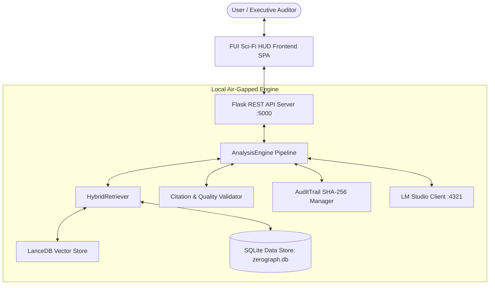

# ⚡ ZeroGraph AI — KZSAMIR Workstation Pro

> **100% Air-Gapped Local Operational Intelligence & Forensic Audit Engine**
> 
> *Developer:* **kzsamir** | *License:* MIT | *Status:* Production Air-Gapped Core

---

## 🌟 Overview

**ZeroGraph AI** is a local, privacy-first Business Intelligence and Operational Audit Command Center built to analyze organization chat histories, event logs, and operational communications completely offline.

Featuring a high-density, pitch-black **Sci-Fi FUI (Fictional User Interface) / HUD Aesthetic**, ZeroGraph AI processes complex data streams into concise, structured **Bengali Executive Briefs** complete with clickable evidence citations (`[msg_xxxxxx]`), cryptographic SHA-256 hash chains, and real-time hardware telemetry.

---

## 🚀 Key Architectural Features

### 1. 🛡️ 100% Air-Gapped Hybrid RAG Architecture
- **Vector Search Engine:** Local **LanceDB** vector store using `sentence-transformers/all-MiniLM-L6-v2` for semantic search across 6,914+ evidence records.
- **Knowledge Graph Database:** **SQLite** database (`data/zerograph.db`) storing structured message logs, sender metadata, event links, findings, and action items.
- **Local LLM Engine:** Seamless integration with **LM Studio** (`http://127.0.0.1:4321/v1`) supporting `gemma-4-e4b`, `qwen2.5`, and `llama-3.2` without sending a single byte to external clouds.

### 2. 🖥️ Pitch-Black Sci-Fi FUI / HUD Command Center Layout
- **Minimalist Monospace Aesthetics:** Designed with pitch-black surfaces (`#050505`), crisp grid dividers, micro-animated indicator dots (`●`), and high-density monospace typography.
- **3 Visual Navigation Clusters:**
  - 📊 **CORE INTELLIGENCE:** Executive Overview, Ask Intelligence.
  - 🔍 **AUDIT & GOVERNANCE:** Findings Register, Risk Matrix, Action Items, Evidence Queue, Timeline Hub.
  - ⚙️ **SYSTEM TELEMETRY:** Data Quality Audit, System Health Telemetry, Analysis History, Defensible Exports, Engine Settings.
- **Collapsible Detail Panel (`[ 👁️ TOGGLE PANEL ]`):** Responsive 3-column workspace layout that slides open/closed for wide data tables.

### 3. 🎯 Fact-Checked Evidence Citations & Hash Chains
- **Verifiable Citations:** Every factual claim generated by the LLM is anchored by clickable evidence tags (`[msg_004588]`). Clicking any chip opens a detailed surrounding context window.
- **SHA-256 Audit Trail:** Every analysis run computes cryptographic hash chains (`previous_run_hash`, `output_hash`, `current_run_hash`) ensuring tamper-proof compliance logging.
- **Bengali Script Optimization:** Tailored line-height (`1.65`) and letter-spacing (`0.2px`) specifically for Bengali script readability inside dark grid containers.

### 4. 📋 One-Click Contextual Exports
- **1-Click Markdown Copy (`📋 COPY BRIEF (.MD)`):** Instant clipboard copy of the defensible brief and cited findings.
- **JSON & CSV Downloads (`📥 EXPORT BRIEF`, `📊 EXPORT FINDINGS`):** One-click download of findings, risk matrices, and action items.

---

## 🛠️ System Architecture Diagram



---

## ⚡ Quick Start Guide

### Prerequisites
- **Python:** 3.10+
- **LM Studio:** Download and run [LM Studio](https://lmstudio.ai/) with your preferred local LLM model (e.g. `gemma-4-e4b` or `qwen2.5-7b`). Enable the Local Server on port `4321`.

### 1. Installation
Clone the repository and install dependencies:
```bash
git clone https://github.com/kzmdsamir/ZeroGraph-AI.git
cd ZeroGraph-AI
python -m venv venv
.\venv\Scripts\activate
pip install -r requirements.txt
```

### 2. Environment Configuration (`.env`)
Ensure your `.env` file points to your local LM Studio endpoint:
```env
APP_NAME="ZeroGraph AI"
DEVELOPER="kzsamir"
APP_MODE="airgapped"
LM_STUDIO_URL="http://127.0.0.1:4321/v1"
LLM_MODEL="google/gemma-4-e4b"
ZEROGRAPH_DB_PATH="data/zerograph.db"
```

### 3. Database Migration
Initialize the SQLite schema and migrate evidence data:
```bash
python database/migrate.py
```

### 4. Launch Application Server
Start the Flask backend and FUI command center interface:
```bash
python server.py
```
Open your browser and navigate to: **`http://127.0.0.1:5000/`**

---

## 📁 Repository Structure

```
ZeroGraph-AI/
├── api/                    # Flask REST API blueprint endpoints
│   ├── actions.py          # Corrective action items & status updates
│   ├── analysis.py         # Analysis engine execution route
│   ├── evidence.py         # Evidence message lookup & context window
│   ├── export.py           # Markdown/CSV/JSON report exporter
│   ├── findings.py         # Audit findings & severity register
│   └── risks.py            # Risk matrix & hardware telemetry
├── database/               # Database management & schema
│   ├── connection.py       # SQLite connection helper
│   ├── migrate.py          # Data migration script (6,914 messages)
│   └── schema.py           # 15-table SQLite relational schema
├── services/               # Core RAG intelligence services
│   ├── analysis_engine.py  # Pipeline orchestrator
│   ├── audit_trail.py      # SHA-256 hash chaining
│   ├── citation_validator.py # Evidence citation validation
│   ├── data_quality.py     # Completeness & limitation metrics
│   ├── lm_studio_client.py # Air-gapped LM Studio REST client
│   └── retrieval.py        # Hybrid vector + keyword + graph retriever
├── static/                 # FUI Command Center Frontend
│   ├── css/
│   │   └── design-system.css # Pitch-Black FUI HUD design system
│   └── js/
│       ├── api.js          # REST API client
│       ├── app.js          # SPA router & panel toggler
│       ├── components.js   # FUI HUD UI component library
│       ├── evidence-drawer.js # Evidence inspector sidebar
│       └── pages/          # Individual SPA page view modules
├── templates/              # HTML layout shell
│   └── index.html          # FUI HUD 3-column SPA interface
├── config.py               # Centralized configuration & URL sanitizer
├── server.py               # Flask application entry point
├── .env                    # Environment settings
└── README.md               # Documentation
```

---

## 📡 Key REST API Endpoints

| Method | Endpoint | Description |
| :--- | :--- | :--- |
| `GET` | `/api/system-health` | Real-time CPU, RAM, SQLite, and LM Studio telemetry |
| `POST` | `/api/analyze` | Run local RAG inference pipeline & generate brief |
| `GET` | `/api/evidence/<id>` | Fetch specific message, author tags, and context window |
| `GET` | `/api/findings` | Fetch structured findings and severity ratings |
| `GET` | `/api/actions` | Fetch corrective action items and owner assignments |
| `POST` | `/api/actions/<id>/status` | Live status update (`OPEN`, `IN_REVIEW`, `RESOLVED`, `CLOSED`) |
| `GET` | `/api/risks` | Calculate multi-factor Likelihood x Impact x Exposure matrix |
| `GET` | `/api/export/findings` | Defensible export in CSV or JSON format |

---

## 👨‍💻 Developer & Credits

Designed and developed by **kzsamir** as an advanced local-LLM RAG workstation for offline business intelligence, organizational audit, and forensic message analysis.

---

*ZeroGraph AI — 100% Air-Gapped Operational Command Center.*
